##adult dataset with different priority metrics (c = d = 0.01)

stop after 2,600,000 cache entries

| priority metric | time (s) | objective | lower bound | accuracy | upper bound | best prefix |
| --- | --- | --- | --- | --- | --- | --- |
| breadth_first | 243.988 | 0.201 | 0.075 | 0.829 | 0.955 | (43, 122, 121) |
| curiosity | 132.145 | 0.221 | 0.058 | 0.809 | 0.972 | (41, 43, 69) |
| lower_bound | 120.940 | 0.204 | 0.072 | 0.826 | 0.958 | (43, 179, 121) |
| objective | 212.122 | 0.201 | 0.075 | 0.829 | 0.955 | (43, 122, 121) |

###breadth_first

	if {capital.gain=7298LessThancapital-gain,capital.loss=capital-lossEQ0} then predict 0
	else if {marital.status=Married,occupation=Prof-specialty} then predict 0
	else if {marital.status=Married,occupation=Exec-managerial} then predict 0
	else predict 1

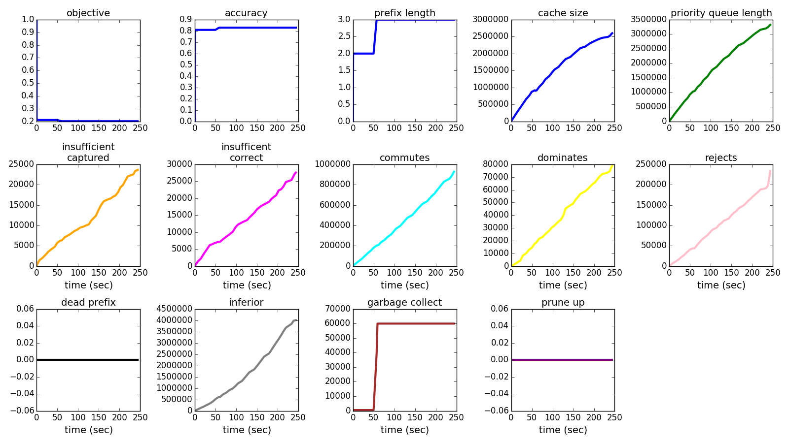
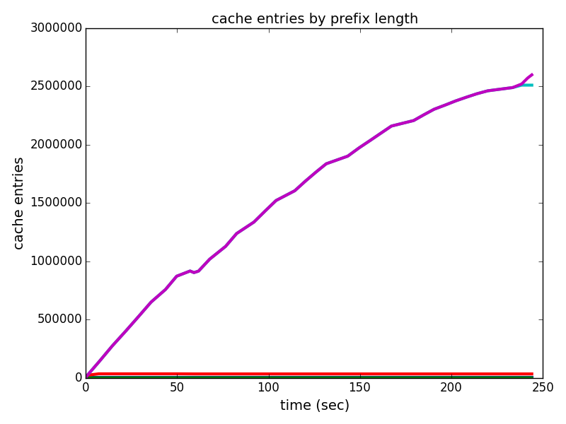
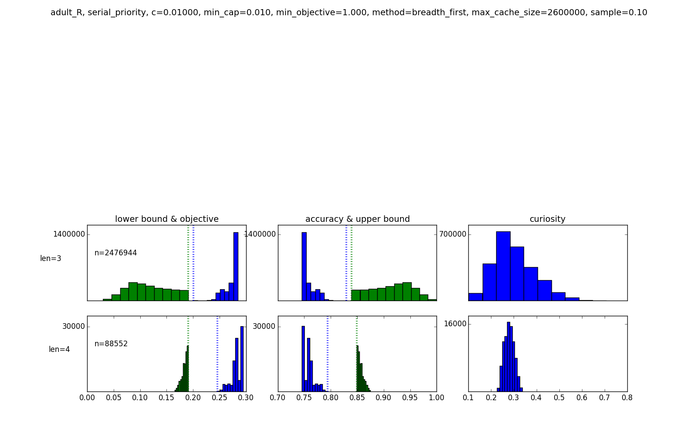

###curiosity

	if {age=Young,workclass=Private} then predict 1
	else if {capital.gain=7298LessThancapital-gain,capital.loss=capital-lossEQ0} then predict 0
	else if {education=Bachelors,marital.status=Married} then predict 0
	else predict 1

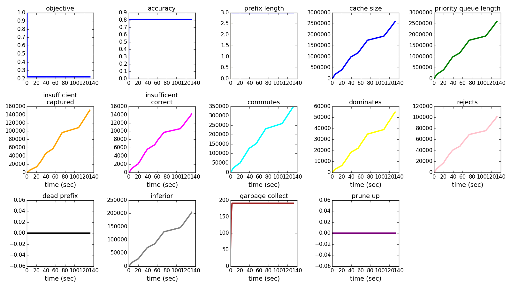
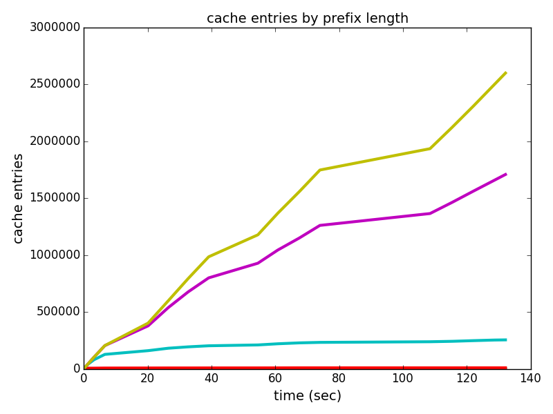
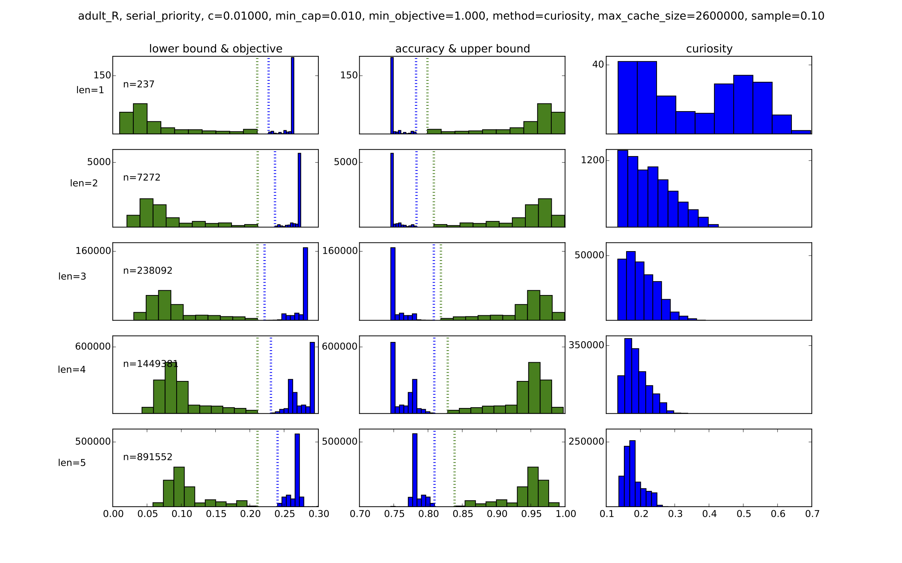

###lower_bound

	if {capital.gain=7298LessThancapital-gain,capital.loss=capital-lossEQ0} then predict 0
	else if {occupation=Prof-specialty,relationship=Husband} then predict 0
	else if {marital.status=Married,occupation=Exec-managerial} then predict 0
	else predict 1

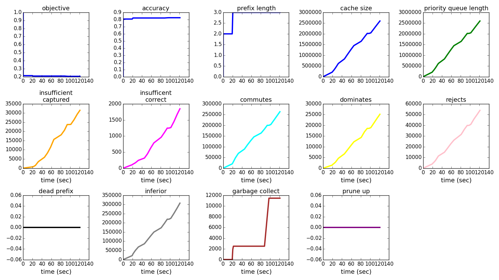
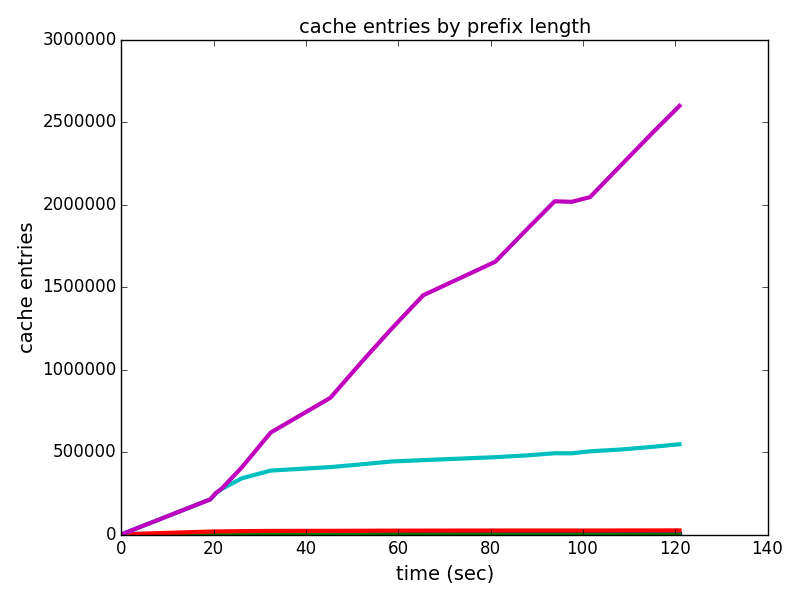
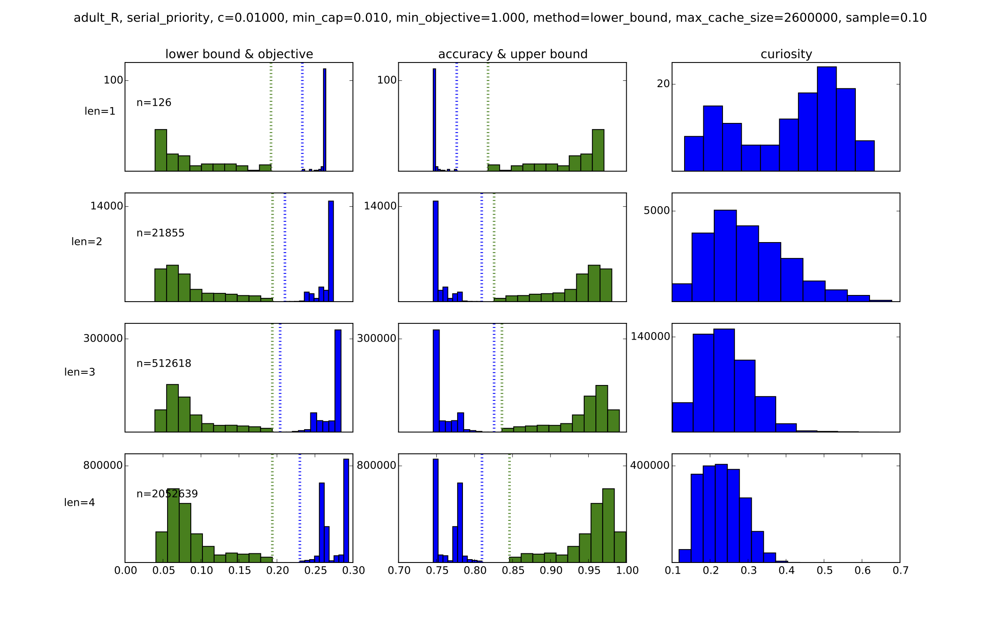

###objective

	if {capital.gain=7298LessThancapital-gain,capital.loss=capital-lossEQ0} then predict 0
	else if {marital.status=Married,occupation=Prof-specialty} then predict 0
	else if {marital.status=Married,occupation=Exec-managerial} then predict 0
	else predict 1

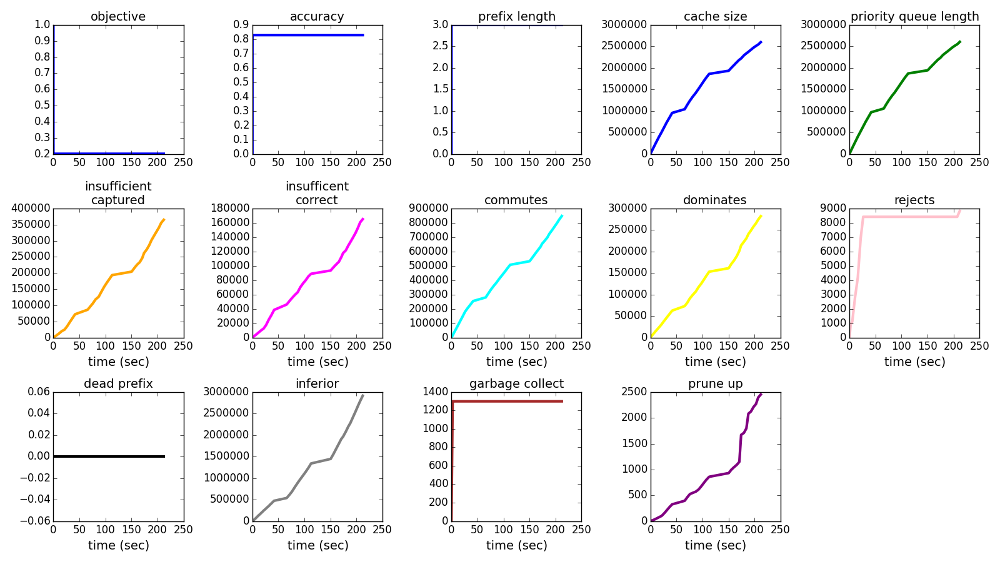
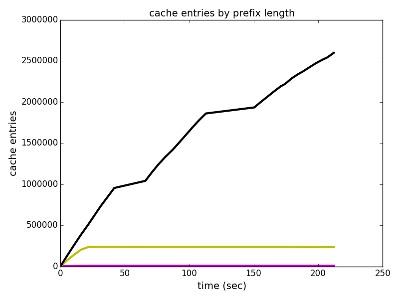
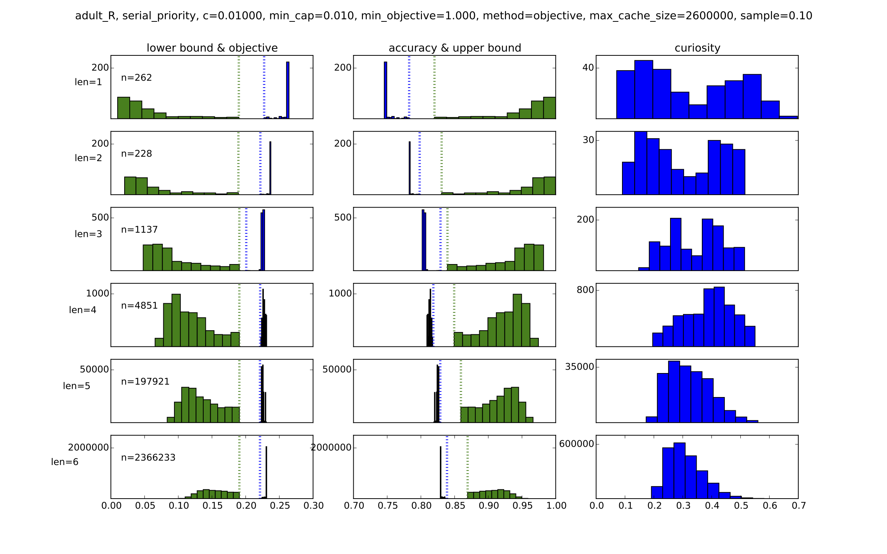

###random (start from min_objective = 0.201)

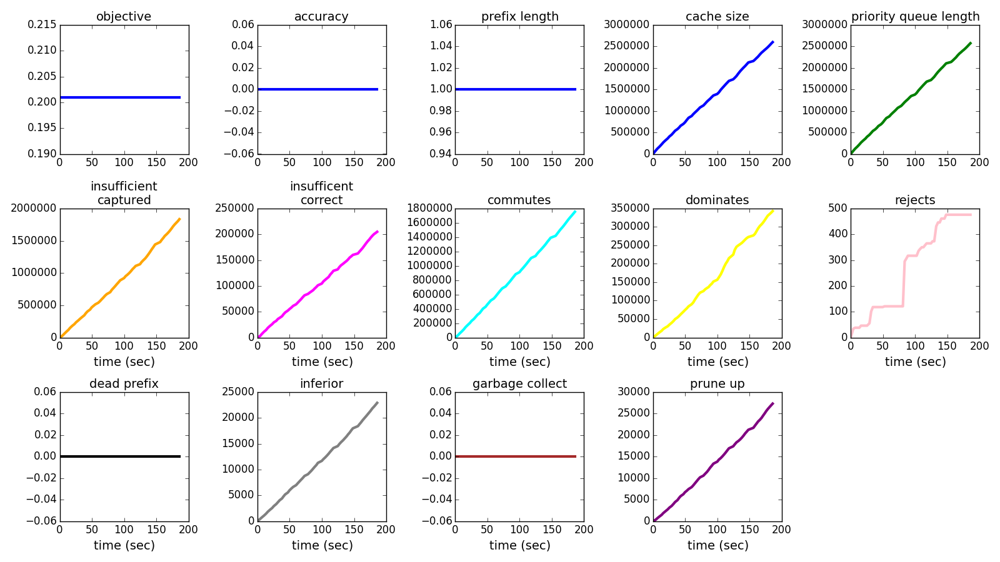
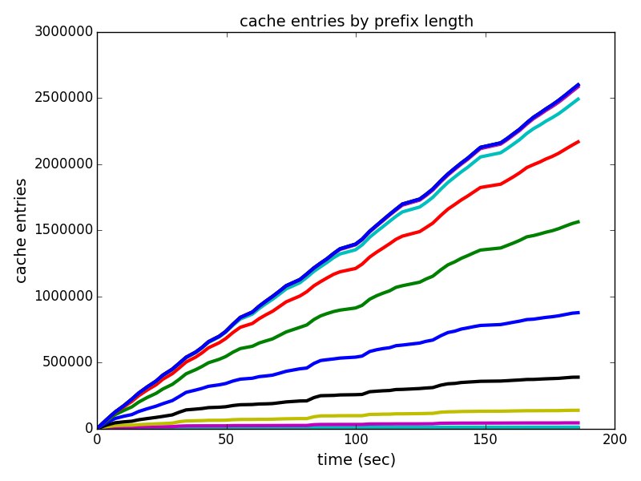
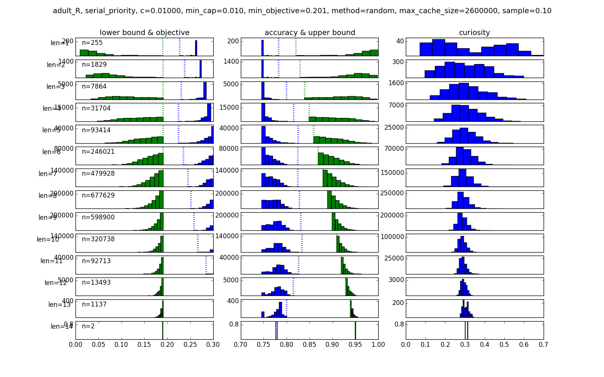
