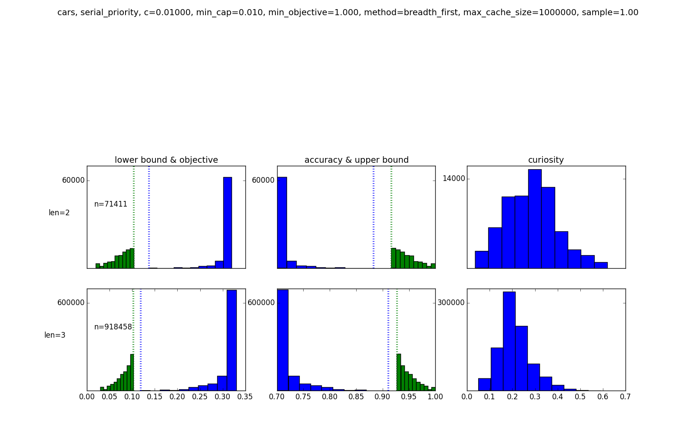
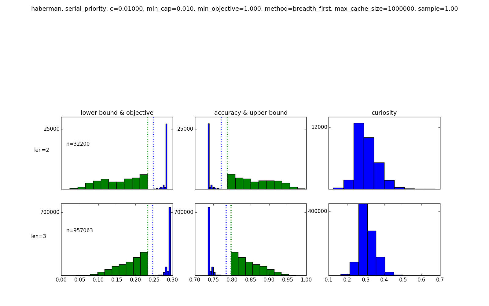
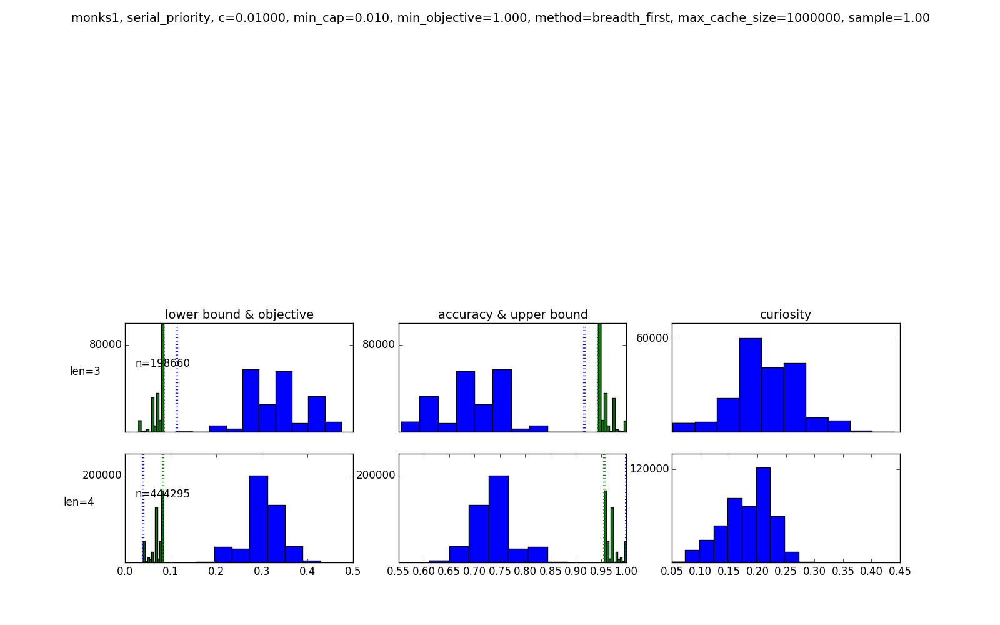
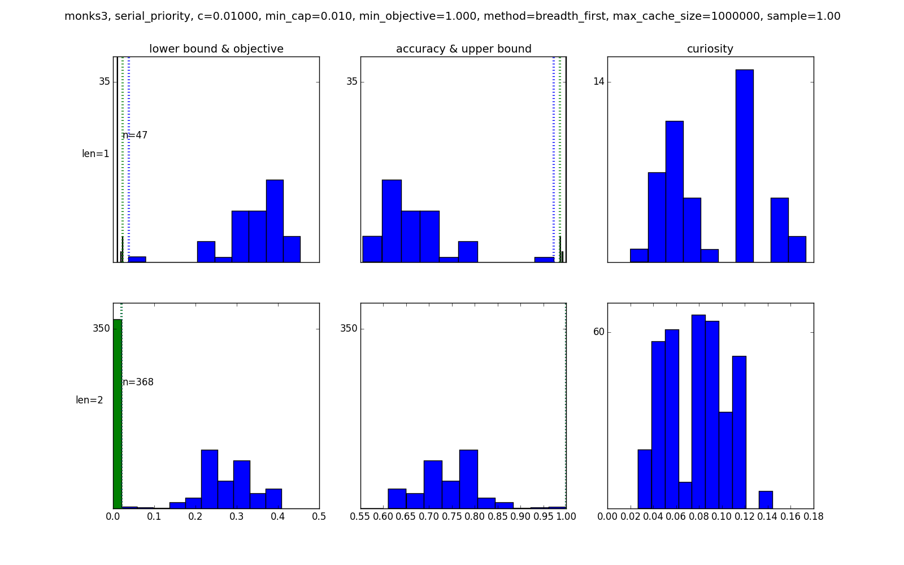

##small datasets (c=0.010, max_cache_size=1000000)

expanded with maximum cardinality = 2 and minimum support = 10%

| dataset | method | time (s) | cache | queue | objective | lower bound | accuracy | upper bound | length |
| --- | --- | --- | --- | --- | --- | --- | --- | --- | --- |
| bcancer | breadth_first | 158.960 | 1000112 | 993849 | 0.055 | 0.049 | 0.965 | 0.971 | 2 |
| bcancer | curiosity | 291.485 | 1000003 | 1008518 | 0.058 | 0.050 | 0.952 | 0.960 | 1 |
| cars | breadth_first | 166.212 | 1000134 | 1343142 | 0.105 | 0.105 | 0.925 | 0.925 | 3 |
| cars | curiosity | 51.299 | 1000058 | 1028341 | 0.115 | 0.061 | 0.925 | 0.979 | 4 |
| haberman | breadth_first | 59.189 | 1000066 | 1042599 | 0.242 | 0.190 | 0.788 | 0.840 | 3 |
| haberman | curiosity | 49.849 | 1000059 | 1090107 | 0.246 | 0.151 | 0.784 | 0.879 | 3 |
| monks1 | breadth_first | 78.709 | 249313 | 326983 | 0.040 | 0.040 | 1.000 | 1.000 | 4 |
| monks1 | curiosity | 1.082 | 147 | 0 | 0.040 | 0.040 | 1.000 | 1.000 | 4 |
| monks2 | breadth_first | 57.658 | 1000002 | 1002149 | 0.317 | 0.271 | 0.713 | 0.759 | 3 |
| monks2 | curiosity | 219.933 | 1000004 | 1144295 | 0.225 | 0.225 | 0.875 | 0.875 | 10 |
| monks3 | breadth_first | 0.074 | 395 | 379 | 0.020 | 0.020 | 1.000 | 1.000 | 2 |
| monks3 | curiosity | 0.016 | 42 | 0 | 0.020 | 0.020 | 1.000 | 1.000 | 2 |
| votes | breadth_first | 279.639 | 90029 | 0 | 0.054 | 0.021 | 0.956 | 0.989 | 1 |
| votes | curiosity | 337.237 | 17 | 0 | 0.054 | 0.021 | 0.956 | 0.989 | 1 |

###bcancer, breadth_first

	if {a8<5:0,a1<5:0} then predict 1
	else if {a6>7:0,a2<5:1} then predict 0
	else predict 1

###bcancer, curiosity

	if {a6>7:0,a2<5:1} then predict 0
	else predict 1

###cars, breadth_first

	if {buying=high:1,maint=vhigh:1} then predict 0
	else if {buying=vhigh:1,maint=low:0} then predict 0
	else if {safety=low:0,persons=2:0} then predict 1
	else predict 0

###cars, curiosity

	if {safety=low:1} then predict 0
	else if {persons=2:1} then predict 0
	else if {buying=high:1,maint=vhigh:1} then predict 0
	else if {buying=vhigh:1,maint=low:0} then predict 0
	else predict 1

###haberman, breadth_first

	if {year>65:1,age60-69:0} then predict 1
	else if {nodes1-9:1,age>69:0} then predict 1
	else if {nodes0:0,age<40:0} then predict 0
	else predict 1

###haberman, curiosity

	if {nodes0:1} then predict 1
	else if {year>65:1,age60-69:0} then predict 1
	else if {nodes1-9:0,age<40:0} then predict 0
	else predict 1

###monks1, breadth_first

	if {a2=1:1,a1=1:1} then predict 1
	else if {a1=2:1,a2=2:1} then predict 1
	else if {a1=3:0,a5=1:0} then predict 0
	else if {a5=1:0,a2=3:0} then predict 0
	else predict 1

###monks1, curiosity

	if {a5=1:1} then predict 1
	else if {a1=3:1,a2=3:0} then predict 0
	else if {a1=2:1,a2=2:0} then predict 0
	else if {a1=1:1,a2=1:0} then predict 0
	else predict 1

###monks2, breadth_first

	if {a4=1:0,a2=1:0} then predict 0
	else if {a6=1:1,a3=2:0} then predict 0
	else if {a1=1:0,a5=1:0} then predict 1
	else predict 0

###monks2, curiosity

	if {a2=1:1,a4=1:1} then predict 0
	else if {a2=1:1,a1=1:1} then predict 0
	else if {a4=1:1,a1=1:1} then predict 0
	else if {a6=1:0,a3=2:1} then predict 0
	else if {a6=1:1,a3=2:0} then predict 0
	else if {a2=1:1,a5=1:0} then predict 1
	else if {a4=1:1,a5=1:0} then predict 1
	else if {a1=1:0,a5=1:0} then predict 0
	else if {a5=1:1,a1=1:1} then predict 0
	else if {a4=1:0,a2=1:0} then predict 1
	else predict 0

###monks3, breadth_first

	if {a2=3:0,a5=4:0} then predict 1
	else if {a5=3:1,a4=1:1} then predict 1
	else predict 0

###monks3, curiosity

	if {a2=3:0,a5=4:0} then predict 1
	else if {a5=3:1,a4=1:1} then predict 1
	else predict 0

###votes, breadth_first

	if {V4:0} then predict 1
	else predict 0

###votes, curiosity

	if {V4:0} then predict 1
	else predict 0

