##small datasets (with varying amounts of regularization)

| dataset | c | d | time (s) | objective | lower bound | accuracy | upper bound | length |
| --- | --- | --- | --- | --- | --- | --- | --- | --- |
| bcancer | 0.010 | 0.010 | 3.676 | 0.058 | 0.050 | 0.952 | 0.960 | 1 |
| cars | 0.010 | 0.010 | 6.832 | 0.123 | 0.123 | 0.897 | 0.897 | 2 |
|
| haberman | 0.010 | 0.010 | 50.015 | 0.245 | 0.239 | 0.775 | 0.781 | 2 |
| monks1 | 0.010 | 0.010 | 200.692 | 0.040 | 0.040 | 1.000 | 1.000 | 4 |
| monks2 | 0.010 | 0.010 | 46.089 | 0.339 | 0.052 | 0.671 | 0.958 | 1 |
| monks3 | 0.010 | 0.010 | 0.054 | 0.020 | 0.020 | 1.000 | 1.000 | 2 |
| votes | 0.010 | 0.010 | 430.891 | 0.054 | 0.021 | 0.956 | 0.989 | 1 |

###bcancer, c=0.010, d=0.010

	if {a8<5=a8<5:0,a1<5=a1<5:0} then predict 1
	else if {a6>7=a6>7:0,a2<5=a2<5:1} then predict 0
	else predict 1

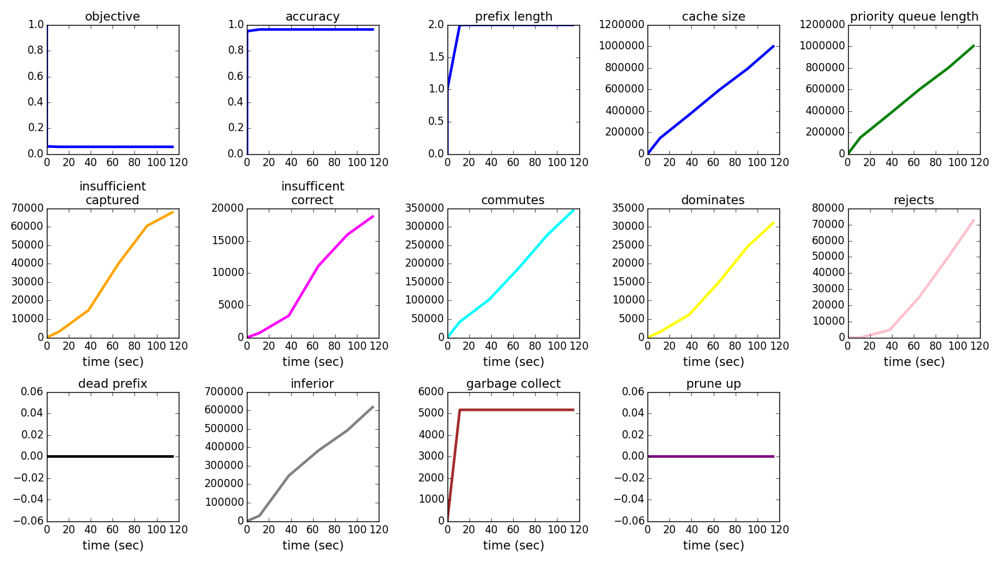
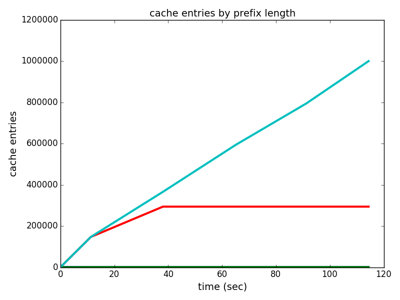

###cars, c=0.010, d=0.010

	if {buying=vhigh=buying=vhigh:1,maint=low=maint=low:0} then predict 0
	else if {safety=med=safety=med:1,lug-boot=small=lug-boot=small:1} then predict 0
	else if {safety=low=safety=low:0,persons=2=persons=2:0} then predict 1
	else predict 0

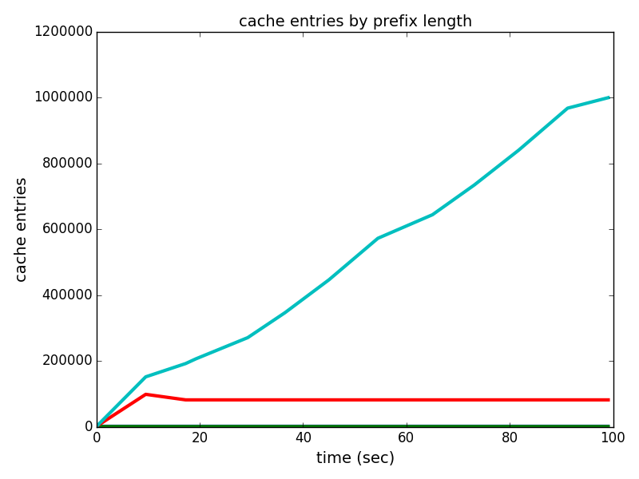

###haberman, c=0.010, d=0.010

	if {nodes10-19=nodes10-19:0,nodes>29=nodes>29:0} then predict 1
	else if {year>65=year>65:0,age<40=age<40:0} then predict 0
	else predict 1

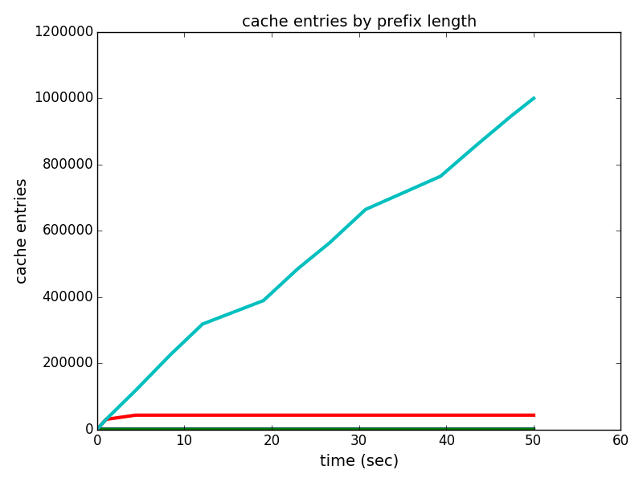

###monks1, c=0.010, d=0.010

	if {a1=2=a1=2:1,a2=2=a2=2:1} then predict 1
	else if {a5=1=a5=1:1,a5=2=a5=2:0} then predict 1
	else if {a2=1=a2=1:0,a1=3=a1=3:0} then predict 0
	else if {a1=1=a1=1:0,a2=3=a2=3:0} then predict 0
	else predict 1

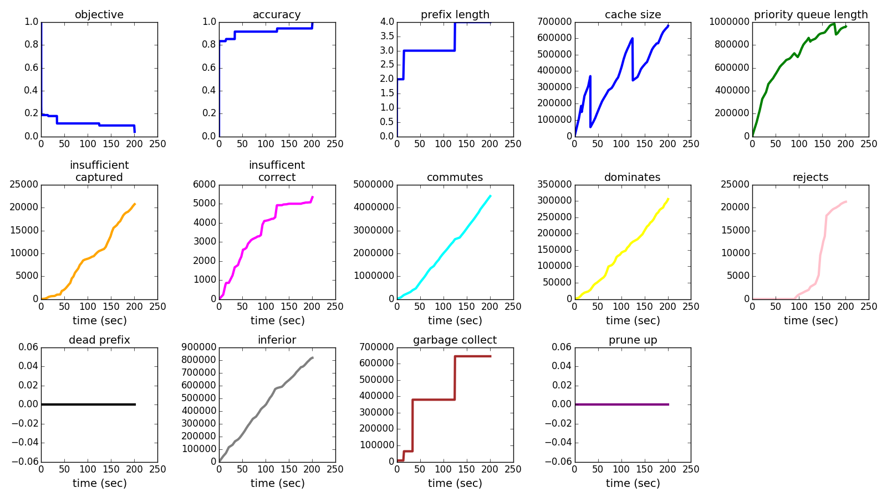
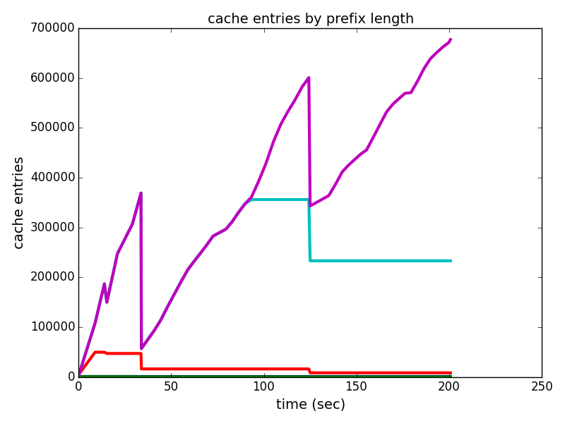

###monks2, c=0.010, d=0.010

	if {a5=2=a5=2:1,a3=2=a3=2:1} then predict 0
	else predict 0

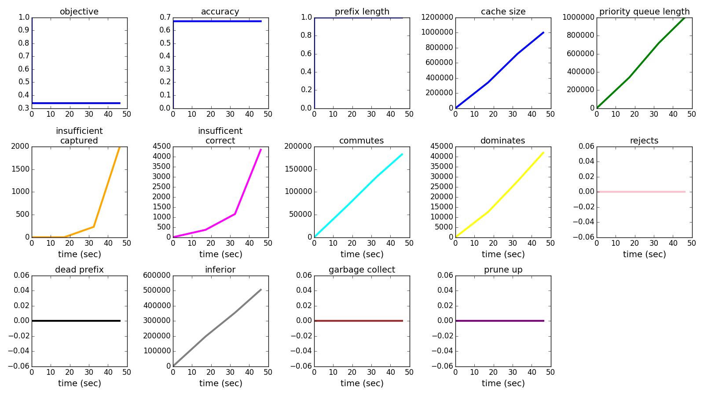
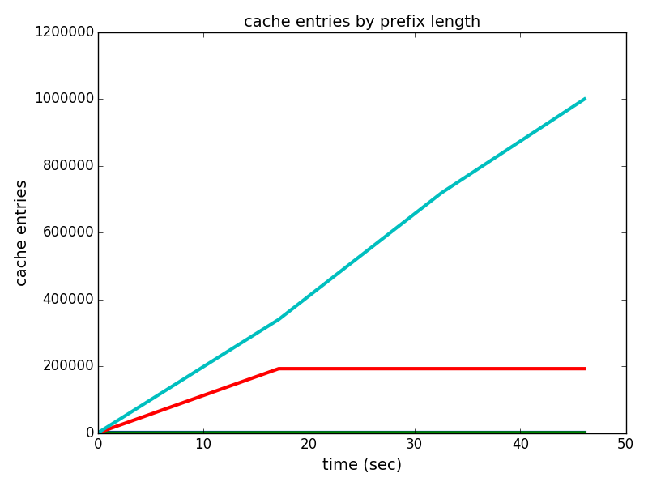

###monks3, c=0.010, d=0.010

	if {a5=3=a5=3:1,a4=1=a4=1:1} then predict 1
	else if {a2=3=a2=3:0,a5=4=a5=4:0} then predict 1
	else predict 0

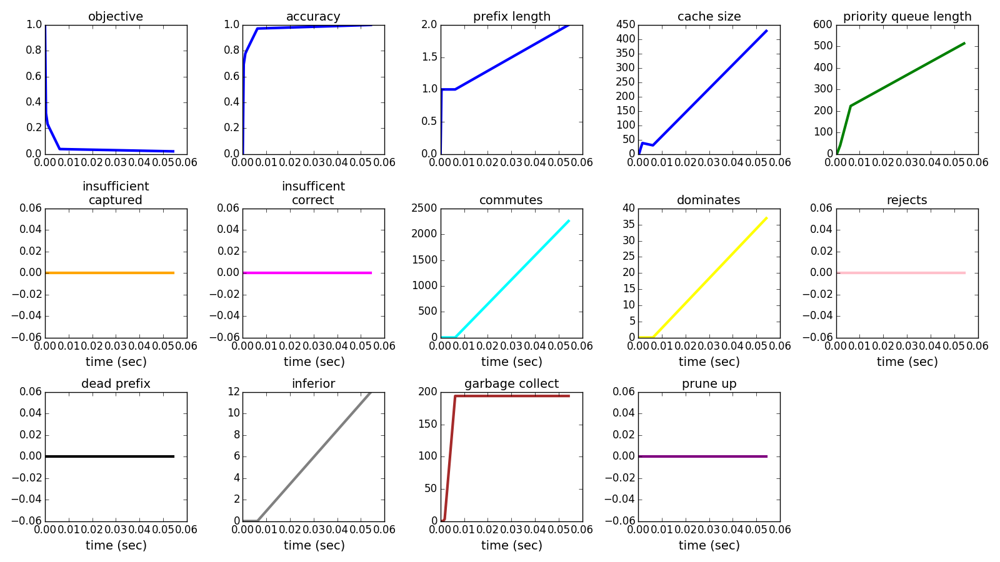
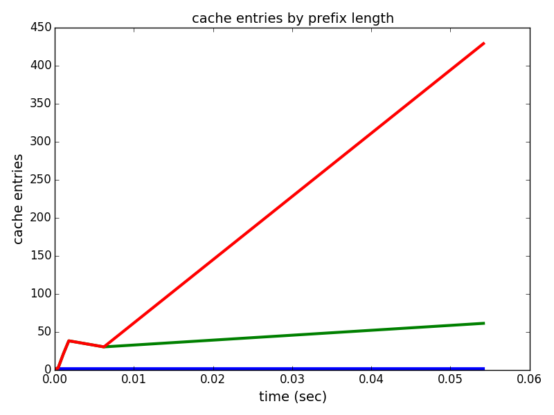

###votes, c=0.010, d=0.010

	if {V4=V4:0} then predict 1
	else predict 0

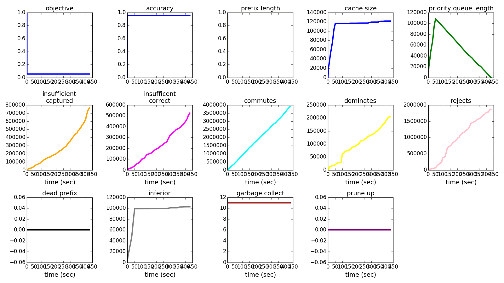
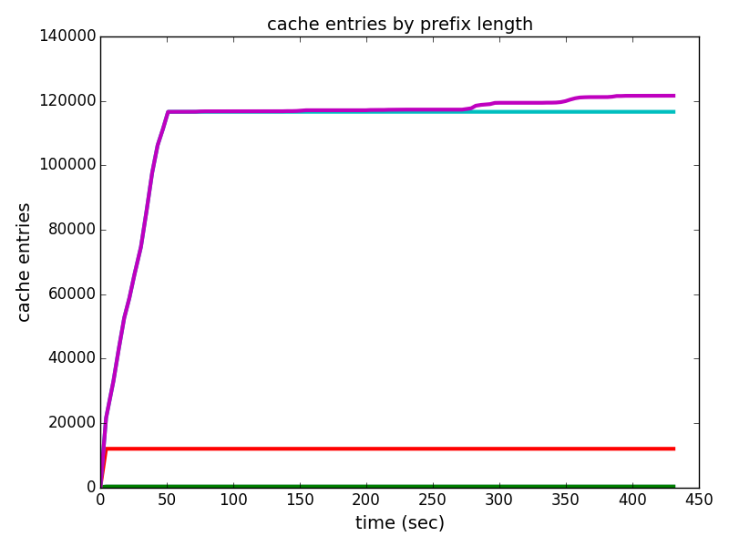
