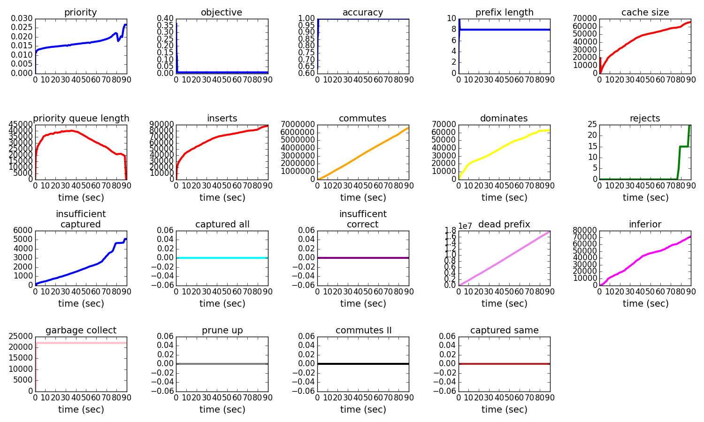
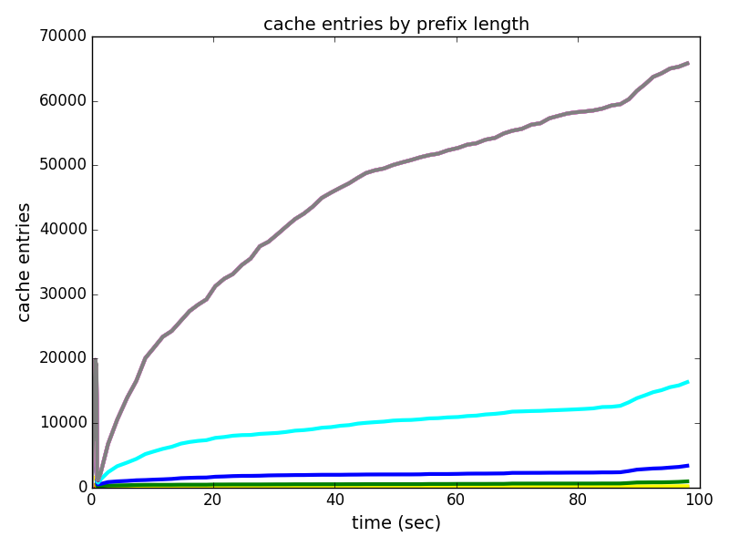

##tic-tac-toe dataset (curiosity, c = d = 0.001)

	if {c3=x,c5=x,c7=x} then predict 1
	else if {c7=x,c8=x,c9=x} then predict 1
	else if {c1=x,c2=x,c3=x} then predict 1
	else if {c2=x,c5=x,c8=x} then predict 1
	else if {c1=x,c5=x,c9=x} then predict 1
	else if {c3=x,c6=x,c9=x} then predict 1
	else if {c1=x,c4=x,c7=x} then predict 1
	else if {c4=x,c5=x,c6=x} then predict 1
	else predict 0

